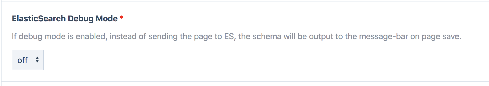

# ElasticsearchFeeder

[](https://opensource.org/licenses/MIT)
[](https://github.com/processwire/processwire)
[](https://circleci.com/gh/blue-tomato/ElasticsearchFeeder/tree/master)

This ElasticSearch module for [ProcessWire CMS/CMF](http://processwire.com/) will sync your page content to an ElasticSearch index, which provides you a convenient way to search it.

## Table of Contents

- [Features](#features)
- [Prerequisites](#prerequisites)
- [Installation](#installation)
- [Usage](#usage)
  - [Module Configuration](#configuration)
  - [Schema](#schema)
- [Support](#support)
- [Contributing](#contributing)
- [License](#license)

## Features

- Batch add / updates pages in ElasticSearch
- Add / update page in ElasticSearch after page save/publish
- Remove page from ElasticSearch after trash, delete or unpublish page

## Prerequisites

Before you'll start using this module, make sure it's compatible with your technical ElasticSearch setup and that it's fulfills your content indexing requires. We've created this module to support a `bonsai.io` (alternatives: [AWS ES](https://aws.amazon.com/de/elasticsearch-service/), [Elastic Cloud](https://www.elastic.co/cloud), [Google Cloud](https://console.cloud.google.com/marketplace/details/google/elasticsearch), etc.) hosted ElasticSearch SaaS instance. It should also work with own-hosted ElasticSearch instances or within Docker-Containers.

Usually ES SaaS providers inform about this in a setup/configuration section in their backend.

E.g. for bonsai.io: `https://{ES_ACCESS_KEY}:{ES_ACCESS_SECRET}@{ES_INSTANCE_URL}.bonsaisearch.net`
E.g. for local ElasticSearch: `http://localhost:9200`

## Installation

1. Execute the following command in the root directory of your ProcessWire installation:

```
composer require blue-tomato/elasticsearch-feeder
```

2. ProcessWire will detect the module and list it in the backend's `Modules` > `Site` > `ElasticsearchFeeder` section. Navigate there and install it.

## Usage

To use this module you'll have to setup some module configurations and schema instructions.

*NOTE: This module will save time of the last update for each page in a meta field called `elasticsearch_lastindex`. You can access this value with `$page->meta('elasticsearch_lastindex')`*

### Configuration

Configure the module in your ProcessWire module backend (which will be available after the module was installed). The module configuration enables to do the following via a ProcessWire-driven backend form:

- define ES backend protocol (http or https)
- insert `ES_ACCESS_HOST`
- insert `ES_ACCESS_KEY` (optional)
- insert `ES_ACCESS_SECRET` (optional)
- insert the path to your schema (see [Schema](#schema) to see how those work)
- optionally insert a prefix string that'll be used when hashing your ES ids
- insert template configurations (see [Schema](#schema) to see how those work)
- (re)index all pages matching our module configuration by clicking the "Index All Pages" button. *NOTE: using this option can take quite a long time (primarily depending on how much ProcessWire pages you're going to send to the ElasticSearch index).*
- or use the batchSync.php script (description below)

### Schema

Setup a schema or multiple schemas to define which content(s) will be shipped to your ElasticSearch instance. Consider to place your schema files with a `.schema.php` file ending in the directory path you declared when configuring your module in the ProcessWire backend.

Basically said: for each ElasticSearch document type, there must be a PHP function returning the contents to be indexed in your ElasticSearch instance.
The naming convention of this function has to be the `camelCased` document type name you declare in the ProcessWire backend module configuration. So i.e.: a document type named **news-details-page** in the ProcessWire backend requires schema function named **newsDetailsPage**.

The filename itself has to be the same name as the template name. I.e.: **news-details-page.php** should be **news-details-page.schema.php**

#### Page Filtering in Schema
If a Schema Function returns `false` as value, the page will not be sent to ElasticSearch. You can use this for filtering you pages and sending only specific pages from this template to ElasticSearch.

#### Schema Function (i.e. news-details-page.schema.php)

This module passes the following arguments to your schema function.

- @arg1 `$page` the ProcessWire page WireArray

```php
function newsDetailsPage($page) {

  // don't send page to Elasticsearch in case we don't want to
  if($page->property->value == "xyz") { return false; }

  // now start building the $document array you want to ship to Elasicsearch
  $document = [];
  $document['type'] = 'news-detailspage';
  $document['name'] = $page->title;

  // if you need to generate an ElasticSeach ID withtin a schema file
  $ElasticsearchFeeder = wire('modules')->get('ElasticsearchFeeder');
  $indexPrefix = $ElasticsearchFeeder->getIndexPrefix();
  $document['some_other_page'] = $ElasticsearchFeeder->createElasticSearchDocumentHashedId($page->get('some_other_page')->id, $indexPrefix),

  // send $document back to ElasticsearchFeeder module
  return $document;
}
```

#### Schema Function Debugging
This module provides a convenient way to debug your schema and thus see what's being sent to ElasticSearch. You can see this after saving a page in the ProcessWire admin message bar as JSON output.

To enable module debugging:
- go to the module configuration page in `Modules` > `Site` > `ElasticsearchFeeder`
- find the debug config area like shown below



### Batch Sync via CLI or Cron
You can send your pages throw the "Index all Pages" button in the module configuration page in `Modules` > `Site` > `ElasticsearchFeeder`. If you have many pages, this can run very long and it can cause server timeouts.

For this reason you can use the `batchSync.php` script in the module path via command line. You can also set up a repeating cronjob to ensure a full sync every _x_ times.

The `batchSync.php` script send all pages to ElasticSearch and checks if all documents in the index are public pages in your ProcessWire system.

I.e:
```bash
php site/modules/ElasticsearchFeeder/batchSync.php
```

### Request to ElasticSearch throw a proxy server
If you have your Server behind a proxy, you can add to your `config.php` file following properties:

- `$config->httpProxy = "your-http-proxy-server.xyz:8888";`
- `$config->httpsProxy = "your-https-proxy-server.xyz:5394";`

### Override ElasticSearch Connection throw config.php
You can override your Connection to ElasticSearch throw `$config->elasticsearchFeederConnectionOverride`. E.g. if you want to work local or on stage Servers with your local ElasticSearch Server but let the Database values untouched.

```php
$config->elasticsearchFeederConnectionOverride = [
  "es_protocol" => "http",
  "es_host" => "localhost:9200",
  "es_access_key" => "",
  "es_access_secret" => ""
];
```

### Deactivate ElasticSearchFeeder throw config.php
If you want to prevent to send pages to ElasticSearch from your development or staging server but don't want to deactivate the module in the database, you can add `$config->elasticsearchFeederDisabled = true` to your `config.php` or `config-dev.php` file. This will prevent of adding the necessary hooks for the indexation.

## ElasticSearch Version and Document-Type

Please consider that ElasticSearch 6.0.0 removed the support for multiple document-types in one and the same index. We support both variants with this module. You can define for each ProcessWire template seperate index and document-type names. I.e. if you use ElasticSearch => 6.0.0, you can use the same name for index and document-type.

https://www.elastic.co/guide/en/elasticsearch/reference/6.x/removal-of-types.html

## Support

Please [open an issue](https://github.com/blue-tomato/ElasticsearchFeeder/issues/new) for support.

## Contributing

Create a branch on your fork, add commits to your fork, and open a pull request from your fork to this repository.

To get better insights and onboard you on module implementation details just open a support issue. We'll get back to you asap.

## Credits

This module is made by people from Blue Tomato. If you want to read more about our work, follow us on https://dev.to/btdev

## License

Find all information about this module's license in the LICENCE.txt file.
